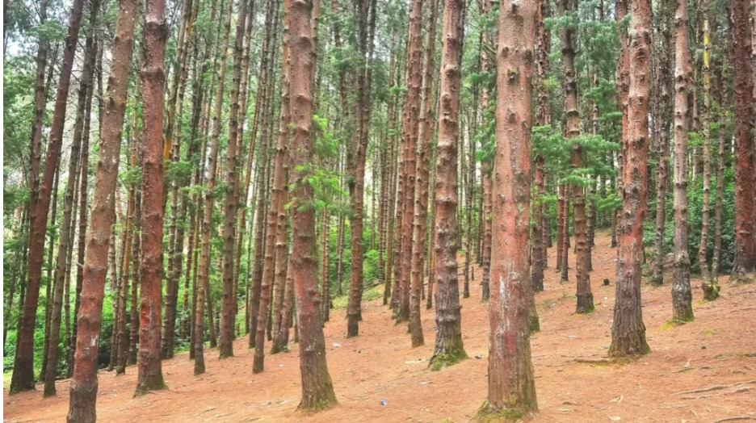
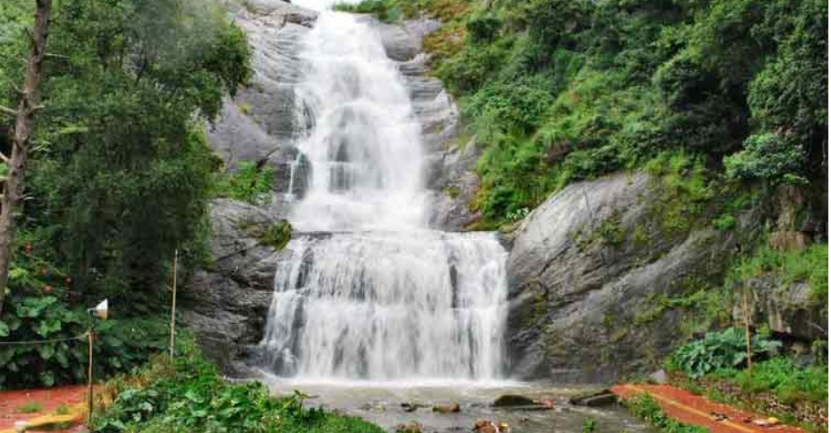

# Ex04 Places Around Me
# Date:01/12/2025
# AIM
To develop a website to display details about the places around my house.

# DESIGN STEPS
## STEP 1
Create a Django admin interface.

## STEP 2
Download your city map from Google.

## STEP 3
Using <map> tag name the map.

## STEP 4
Create clickable regions in the image using <area> tag.

## STEP 5
Write HTML programs for all the regions identified.

## STEP 6
Execute the programs and publish them.

# CODE
```
home.html
<!DOCTYPE html>
<html lang="en">
<head>
    <meta charset="UTF-8">
    <meta name="viewport" content="width=device-width, initial-scale=1.0">
    <title>Document</title>
</head>
<body>
   <!-- Image Map Generated by http://www.image-map.net/ -->
  

<map name="image-map">
    <area target="" alt="coakers" title="coakers" href="coakers.html" coords="759,353,832,422" shape="rect">
    <area target="" alt="silver falls" title="silver falls" href="silver.html" coords="940,259,28" shape="circle">
    <area target="" alt="liril falls" title="liril falls" href="liril.html" coords="541,452,631,449,539,511,628,522,641,493,534,479,630,467,540,481,540,489,540,503,630,477,560,464,546,469" shape="poly">
</map> 
</body>
</html>
liril.html
<!DOCTYPE html>
<html lang="en">
<head>
    <meta charset="UTF-8">
    <meta name="viewport" content="width=device-width, initial-scale=1.0">
    <title>Document</title>
</head>
<body>
    
</body>
</html>
pine.html

<!DOCTYPE html>
<html lang="en">
<head>
    <meta charset="UTF-8">
    <meta name="viewport" content="width=device-width, initial-scale=1.0">"
    <title>Document</title>
</head>
<body>
    
</body>
</html>

coakers.html

<!DOCTYPE html>
<html lang="en">
<head>
    <meta charset="UTF-8">
    <meta name="viewport" content="width=device-width, initial-scale=1.0">
    <title>Document</title>
</head>
<body>
     
</body>
</html>
```
# OUTPUT






# RESULT
The program for implementing image maps using HTML is executed successfully.
